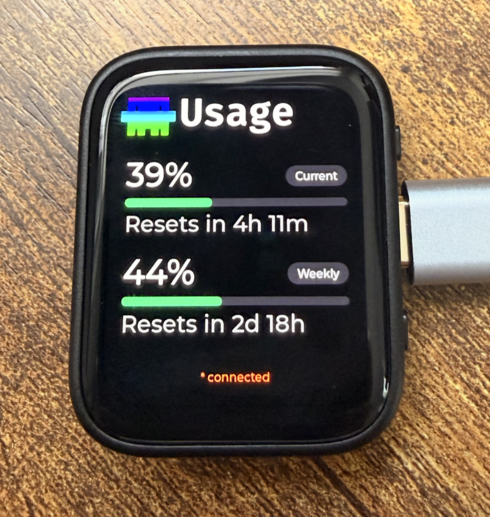

# Claude Usage Monitor

A small AMOLED desk display that shows your **Claude Code usage limits** at a glance: how much of the current 5-hour session and of your weekly limit you've used, and when each one resets. It updates about every 15 seconds.

<p align="center"></p>

It has two parts:

- **A small service** (Node.js/TypeScript) that runs on the computer where you use Claude Code. It works out your current usage and serves it as JSON on your local network.
- **Firmware** for a $30 ESP32-S3 AMOLED board. The board joins your WiFi, polls the service, and draws the screen.

> This is an independent hobby project. It isn't affiliated with or endorsed by Anthropic. It reads files Claude Code keeps on your own computer, and those can change format with any Claude Code update.

---

## Contents

- [How it works](#how-it-works)
- [What you need](#what-you-need)
- [Setup with Claude Code](#setup-with-claude-code)
- [Gotchas](#gotchas)
- [Security](#security)
- [Using a different board](#using-a-different-board)
- [License](#license)

---

## How it works

```
 Your computer                                         Desk device
 ┌──────────────────────────────────────────┐          ┌──────────────────┐
 │ Claude Code ─writes──► ~/.claude.json    │          │ ESP32-S3 AMOLED  │
 │             ─writes──► ~/.claude/projects│  WiFi    │                  │
 │                             │            │ ◄─────── │ GET /usage       │
 │                   usage service :4317 ───┼────────► │ every 15 s       │
 └──────────────────────────────────────────┘   JSON   └──────────────────┘
```

Anthropic doesn't publish an API for "how much of my limit is left", but Claude Code already knows the exact figure: it's what the `/usage` panel shows. The service gets the number from the most accurate source available, checked separately for the session and for the week:

1. **Claude Code's local usage cache** (`~/.claude.json`). This is the exact figure from the `/usage` panel, and it needs no network calls or credentials. Claude Code only refreshes it occasionally, though, so the service ignores it once it's more than an hour old.
2. **Anthropic's live usage endpoint.** *Off by default.* See [Grey `~` numbers, and the optional live API](#grey--numbers-and-the-optional-live-api).
3. **A local estimate** built from Claude Code's transcripts using [ccusage](https://github.com/ryoppippi/ccusage).

The device finds your computer by its `.local` hostname, not by IP address.

---

## What you need

### Hardware

| Item | Notes |
|---|---|
| **Waveshare ESP32-S3-Touch-AMOLED-1.8**, revision **V2** | About $28–30 from [Waveshare](https://www.waveshare.com/esp32-s3-touch-amoled-1.8.htm), Amazon, or AliExpress. V2 has the **CO5300** display driver; check the label on the back or the product listing. The original V1 uses different display and touch chips and is **not supported**. The version without a battery is fine, since the device runs on USB power. |
| **USB-C *data* cable** | A charge-only cable won't work: the computer won't detect the board at all. |
| **A 2.4 GHz WiFi network** | The ESP32-S3 can't see 5 GHz networks. Most home routers broadcast both. For an iPhone hotspot, turn on *Settings → Personal Hotspot → Maximize Compatibility*. |

**Board specs:** ESP32-S3 (dual-core, 240 MHz), 16 MB flash, 8 MB PSRAM, 1.8" 368×448 AMOLED (CO5300, QSPI), AXP2101 power chip. The touch screen isn't used.

### Software

| | Needed for | Tested on |
|---|---|---|
| **Claude Code**, signed in with a Claude subscription (Pro/Max) | Producing the usage data | macOS |
| **Node.js 22.12 or newer** and npm | The service | macOS (Apple Silicon). Linux should work the same way. Windows is untested. |
| **Git** | Cloning | |
| **ESP-IDF v5.5.x** | Building and flashing the firmware, once | v5.5.5 on macOS |

The service must run on **the same computer you use Claude Code on**, since it reads that computer's local files. If you use Claude Code on several machines, the device shows the machine the service runs on.

---

## Setup with Claude Code

You already have Claude Code, so let it do the setup. This repo's [`CLAUDE.md`](CLAUDE.md) gives Claude the full architecture and every problem hit while building this, so it knows the pitfalls before it starts. Expect about an hour, mostly spent downloading the ESP32 toolchain.

**Before you start:** plug the board into your computer with the USB-C data cable, and make sure the computer is on the WiFi network you want the board to use.

Clone the repo and open Claude Code inside it:

```bash
git clone https://github.com/panicbus/ClaudeUsageMonitor.git
cd ClaudeUsageMonitor
claude
```

Then paste these prompts one at a time, letting each finish before you send the next.

**1. Start the service**

```
Set up the usage service following README.md and CLAUDE.md: install dependencies,
start it, and confirm http://localhost:4317/usage returns usage JSON. Then find my
computer's .local hostname and confirm the service also answers at that address.
```

**2. Install the ESP32 toolchain**

```
Install ESP-IDF v5.5.5 for the ESP32-S3 at ~/esp/esp-idf, following Espressif's
official guide for my OS, and confirm idf.py works. Tell me before running anything
that needs sudo.
```

**3. Configure the firmware**

```
Create firmware/sdkconfig.defaults.local from the example file. Set
CONFIG_USAGE_SERVICE_URL to my computer's .local hostname, and leave the WiFi
lines blank so I can fill them in myself.
```

Now open `firmware/sdkconfig.defaults.local` and type in your WiFi name and password yourself, so they never go through the chat. You can add up to two fallback networks, such as a phone hotspot. Read [Gotchas](#gotchas) first if you plan to use a hotspot.

**4. Build and flash**

```
I've filled in the WiFi settings. Build the firmware, find the board's serial port,
flash it, and check the serial log until the board connects to WiFi.
```

In a few seconds the screen should show your usage, with `* connected` at the bottom.

**5. Start the service at login**

```
Install the service to start at login using the template in deploy/ for my OS.
Stop the copy you started earlier, then confirm the new one is running and serving
/usage.
```

That's it. The board needs only USB power from now on.

**If something isn't working,** tell Claude what you see, for example: *"The device says `* no signal (5m)`. Figure out why."*

---

## Gotchas

Most setup problems come from these. Claude knows about all of them, but it helps to know them too.

| Gotcha | What happens | Fix |
|---|---|---|
| **Charge-only USB cable** | The computer doesn't detect the board at all, so Claude can't find a serial port. | Use a cable you know carries data. |
| **5 GHz WiFi** | The board never connects. The ESP32-S3 can only see 2.4 GHz networks. | Use a 2.4 GHz network. On an iPhone hotspot, turn on *Settings → Personal Hotspot → Maximize Compatibility*. |
| **Curly apostrophe in iPhone names** | The board never finds a hotspot like `Alex’s iPhone`. iPhones use a curly `’`, and a straight `'` doesn't match. | Copy the name exactly from the phone's settings, or ask Claude to read the exact bytes from your computer's saved networks. |
| **Board and computer on different networks** | `* no signal`. For example, the board is on home WiFi while your laptop is on a hotspot. | Keep both on the same network. The board automatically switches to another configured network after about a minute of failed polls. |
| **Firewall prompt** | `* no signal` right after setup. | On macOS, click **Allow** when asked whether `node` may accept incoming connections. If you missed it, allow `node` in *System Settings → Network → Firewall*. |
| **Computer asleep or off** | `* no signal (Xm)`, while the screen keeps showing the last numbers. | Expected. Data comes back on its own when the computer wakes. |
| **WiFi changes don't take effect** | The board keeps using the old settings after a reflash. | Delete the generated config before rebuilding: `rm -f firmware/sdkconfig` (or ask Claude to "do a clean rebuild"). |
| **Wrong board revision** | A blank or garbled screen. | Only V2 (CO5300 display) is supported. Check the label on the back. |
| **Repo in iCloud (macOS)** | Builds, git, or the service randomly time out. | Clone into a folder outside `~/Documents` and `~/Desktop`, such as `~/Developer`. |

### Grey `~` numbers, and the optional live API

The device shows exact numbers in white. A grey number with a `~` (for example `~42%`) is a **local estimate**: the exact figure wasn't available. This happens because Claude Code only occasionally refreshes the local usage cache the service reads, sometimes hours apart. Weekly estimates tend to be close; session estimates are rougher.

To get exact numbers nearly all the time, you can turn on **`USE_OAUTH_USAGE_API=1`** in `service/.env`. The service then asks Anthropic's **undocumented** usage endpoint, the one Claude Code's own `/usage` panel uses, with the login token Claude Code has already stored on your computer. The token is never logged or sent anywhere else.

**Read this before turning it on:** Anthropic's [Consumer Terms](https://www.anthropic.com/legal/consumer-terms) and its February 2026 update restrict using Claude subscription login credentials in anything other than Claude Code and claude.ai. This use is read-only and low-volume, but it is still a third-party tool using that token, against an endpoint that can change or disappear without notice. **That's why it's off by default.** If you enable it, you do so at your own risk.

---

## Security

- The service listens on `0.0.0.0:4317` **without authentication**, so anyone on your local network can read your usage percentages and token counts. Responses never contain tokens, credentials, or file paths; errors are logged locally and sanitized before they're served. **Don't expose port 4317 to the internet** (no port forwarding).
- WiFi passwords are compiled into the firmware image, so anyone with physical access to the board could read them out of flash.
- `service/.env` and `firmware/sdkconfig.defaults.local` are gitignored. Keep them that way. Type WiFi passwords into the file yourself rather than pasting them into a chat.

---

## Using a different board

**Any device can be the display.** The service is plain HTTP + JSON: anything that can poll `GET /usage` works, such as another microcontroller, an e-ink panel, a Raspberry Pi, or a menu-bar app. The response format is defined in [`shared/src/types.ts`](shared/src/types.ts).

**Porting this firmware to another ESP32 display board** means changing only the board-specific parts:

| File | What's board-specific |
|---|---|
| [`firmware/main/idf_component.yml`](firmware/main/idf_component.yml) | The Waveshare board support package (BSP). Swap in your board's BSP. |
| [`firmware/main/main.c`](firmware/main/main.c) | `bsp_display_start()`, `bsp_display_brightness_set()`, `bsp_display_lock()`/`bsp_display_unlock()` |
| [`firmware/main/power.c`](firmware/main/power.c) | Battery status read from the AXP2101 power chip. Stub it out if your board doesn't have one. |
| [`firmware/main/ui.c`](firmware/main/ui.c) | Layout tuned for a 368 px wide screen (`SCREEN_W`) with fixed row positions |

`wifi.c` and `usage_client.c` are plain ESP-IDF and work on any ESP32 with WiFi. To port with Claude Code:

```
I have a <board name and link>. Port the firmware to it: find its ESP-IDF board
support package, replace the Waveshare-specific parts listed in the README's
"Using a different board" section, and adapt the UI layout to its screen size.
Ask me anything you can't determine from the board's documentation.
```

---

## License

[MIT](LICENSE). Third-party components and fonts are listed in [THIRD_PARTY_NOTICES.md](THIRD_PARTY_NOTICES.md).
